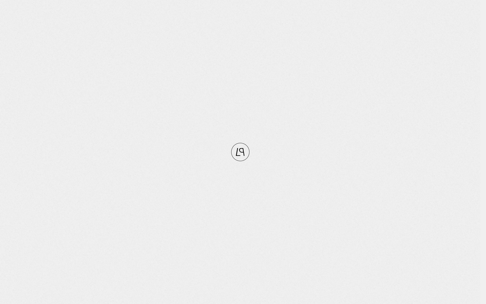

# luxury-places Design System

You are building UI for **luxury-places**. Light-themed, warm palette, sans-serif typography (Poppins), compact density on a 4px grid, flat elevation (no shadows), expressive motion.

## Visual Reference

**IMPORTANT**: Study ALL screenshots below before writing any UI. Match colors, typography, spacing, layout, and motion exactly as shown.

### Homepage



> Read `references/DESIGN.md` for full token details.

## Design Philosophy

- **Gradient accents** — gradients are used thoughtfully for emphasis, not decoration.
- **Single typeface** — Poppins carries all text. Hierarchy comes from size, weight, and color — never font mixing.
- **compact density** — 4px base grid. Every dimension is a multiple of 4.
- **warm palette** — the color temperature runs warm, matching the sans-serif typography.
- **Restrained accent** — `#ff6900` is the only pop of color. Used exclusively for CTAs, links, focus rings, and active states.
- **Expressive motion** — animations are an integral part of the experience. Use spring physics and layout animations.

## Color System

### Core Palette

| Role | Token | Hex | Use |
|------|-------|-----|-----|
| Background | `--background` | `#ffffff` | Page/app background |
| Surface | `--surface` | `#f0f0f0` | Cards, panels, modals |
| Text Primary | `--text-primary` | `#000000` | Headings, body text |
| Text Muted | `--text-muted` | `#666666` | Captions, placeholders |
| Accent | `--accent` | `#ff6900` | CTAs, links, focus rings |

### Status Colors

| Status | Hex | Use |
|--------|-----|-----|
| Success | `#4d9e30` | Confirmations, positive trends |
| Warning | `#f6eb13` | Caution states, pending items |
| Danger | `#fa9f47` | Errors, destructive actions |

### Extended Palette

- `#50b84b`
- `#cadb2a`
- `#fecd07`
- `#ef3a3b` — Warm accent — hover glow or decorative highlight
- **swiper-theme-color:** `#007aff`
- **color-black-40:** `#909090`
- **wp--preset--color--cyan-bluish-gray:** `#abb8c3`
- **wp--preset--color--pale-pink:** `#f78da7`

### CSS Variable Tokens

```css
--border-radius: .13rem;
--border-radius-lg: .25rem;
--color-background-grey: #F0F0F0;
--background-color: var(--color-black);
--background-color: var(--color-black);
--background-color: var(--color-white);
--background-color: var(--color-background-grey);
--header-background-color: var(--color-background-grey);
--header-background-color: transparent;
--header-background-color: var(--color-white);
--property-card-bg-bolor: transparent;
--swiper-pagination-bullet-border-radius: 0px;
--property-card-bg-bolor: var(--color-background-grey);
--property-card-bg-bolor: transparent;
--border-radius: .13rem;
--border-radius-lg: .25rem;
--color-background-grey: #F0F0F0;
--background-color: var(--color-black);
--background-color: var(--color-black);
--background-color: var(--color-white);
```

## Typography

### Font Stack

- **Poppins** — Heading 1, Heading 2, Heading 3, Body, Caption

### Font Sources

```css
@font-face {
  font-family: "Poppins";
  src: url("fonts/Poppins-Bold.ttf") format("truetype");
  font-weight: 700;
}
@font-face {
  font-family: "Poppins";
  src: url("fonts/Poppins-Regular.ttf") format("truetype");
  font-weight: 400;
}
```

### Type Scale

| Role | Family | Size | Weight |
|------|--------|------|--------|
| Heading 1 | Poppins | clamp(2.5rem,6.1111111111vw,5.5rem) | 700 |
| Heading 2 | Poppins | clamp(2rem,4.7222222222vw,4.25rem) | 700 |
| Heading 3 | Poppins | clamp(1.75rem,3.8888888889vw,3.5rem) | 700 |
| Body | Poppins | 1rem | 400 |
| Caption | Poppins | clamp(.75rem,.9722222222vw,.875rem) | 400 |

### Typography Rules

- All text uses **Poppins** — never add another font family
- Max 3-4 font sizes per screen
- Headings: weight 600-700, body: weight 400
- Use color and opacity for text hierarchy, not additional font sizes
- Line height: 1.5 for body, 1.2 for headings

## Spacing & Layout

### Base Grid: 4px

Every dimension (margin, padding, gap, width, height) must be a multiple of **4px**.

### Spacing Scale

`2, 4, 6, 8, 10, 12, 16, 20, 22, 24, 26, 32` px

### Spacing as Meaning

| Spacing | Use |
|---------|-----|
| 4-8px | Tight: related items (icon + label, avatar + name) |
| 12-16px | Medium: between groups within a section |
| 24-32px | Wide: between distinct sections |
| 48px+ | Vast: major page section breaks |

### Border Radius

Scale: `2rem, inherit, .5rem, 3px, 100%, 999px`
Default: `3px`

## Component Patterns

### Card

```css
.card {
  background: #f0f0f0;
  border-radius: 3px;
  padding: 16px;
}
```

```html
<div class="card">
  <h3>Card Title</h3>
  <p>Card content goes here.</p>
</div>
```

### Button

```css
/* Primary */
.btn-primary {
  background: #ff6900;
  color: #000000;
  border-radius: 3px;
  padding: 8px 16px;
  font-weight: 500;
  transition: opacity 150ms ease;
}
.btn-primary:hover { opacity: 0.9; }

/* Ghost */
.btn-ghost {
  background: transparent;
  border: 1px solid #cccccc;
  color: #000000;
  border-radius: 3px;
  padding: 8px 16px;
}
```

```html
<button class="btn-primary">Get Started</button>
<button class="btn-ghost">Learn More</button>
```

### Input

```css
.input {
  background: #ffffff;
  border: 1px solid #cccccc;
  border-radius: 3px;
  padding: 8px 12px;
  color: #000000;
  font-size: 14px;
}
.input:focus { border-color: #ff6900; outline: none; }
```

```html
<input class="input" type="text" placeholder="Search..." />
```

### Badge / Chip

```css
.badge {
  display: inline-flex;
  align-items: center;
  padding: 4px 8px;
  border-radius: 9999px;
  font-size: 12px;
  font-weight: 500;
  background: #f0f0f0;
  color: #666666;
}
```

```html
<span class="badge">New</span>
<span class="badge">Beta</span>
```

### Modal / Dialog

```css
.modal-backdrop { background: rgba(0, 0, 0, 0.6); }
.modal {
  background: #f0f0f0;
  border-radius: 999px;
  padding: 24px;
  max-width: 480px;
  width: 90vw;
}
```

```html
<div class="modal-backdrop">
  <div class="modal">
    <h2>Dialog Title</h2>
    <p>Dialog content.</p>
    <button class="btn-primary">Confirm</button>
    <button class="btn-ghost">Cancel</button>
  </div>
</div>
```

### Table

```css
.table { width: 100%; border-collapse: collapse; }
.table th {
  text-align: left;
  padding: 8px 12px;
  font-weight: 500;
  font-size: 12px;
  color: #666666;
  text-transform: uppercase;
  letter-spacing: 0.05em;
  border-bottom: 1px solid #cccccc;
}
.table td {
  padding: 12px;
  border-bottom: 1px solid #cccccc;
}
```

```html
<table class="table">
  <thead><tr><th>Name</th><th>Status</th><th>Date</th></tr></thead>
  <tbody>
    <tr><td>Item One</td><td>Active</td><td>Jan 1</td></tr>
    <tr><td>Item Two</td><td>Pending</td><td>Jan 2</td></tr>
  </tbody>
</table>
```

### Navigation

```css
.nav {
  display: flex;
  align-items: center;
  gap: 8px;
  padding: 12px 16px;
}
.nav-link {
  color: #666666;
  padding: 8px 12px;
  border-radius: 3px;
  transition: color 150ms;
}
.nav-link:hover { color: #000000; }
.nav-link.active { color: #ff6900; }
```

```html
<nav class="nav">
  <a href="/" class="nav-link active">Home</a>
  <a href="/about" class="nav-link">About</a>
  <a href="/pricing" class="nav-link">Pricing</a>
  <button class="btn-primary" style="margin-left: auto">Get Started</button>
</nav>
```

### Extracted Components

These components were found in the codebase:

**Button** (`html`)
- Variants: `inner`

**Card** (`html`)
- Variants: `link`, `details`, `category`, `redirect`, `redirect-text`

**Navigation** (`html`)

**Modal** (`html`)

**List** (`html`)

## Page Structure

The following page sections were detected:

- **Navigation** — Top navigation bar (3 items)
- **Hero** — Hero section (detected from heading structure)
- **Footer** — Page footer with links and info (9 items)
- **Cards** — Grid of 30 card elements (30 items)
- **Hero** — Hero/banner section with headline and CTAs
- **Faq** — FAQ/accordion section

When building pages, follow this section order and structure.

## Animation & Motion

This project uses **expressive motion**. Animations are part of the design language.

### CSS Animations

- `swiper-preloader-spin`
- `fade-in-slide`
- `fade-out-slide`
- `checkmark`
- `spin`

### Motion Tokens

- **Duration scale:** `1ms`, `200ms`, `300ms`, `500ms`, `600ms`, `800ms`, `1600ms`
- **Easing functions:** `ease-out`, `ease`, `cubic-bezier(0.6,0,0.3,1)`, `cubic-bezier(0.16,1,0.3,1)`
- **Animated properties:** `300ms`

### Motion Guidelines

- **Duration:** Use values from the duration scale above. Short (1ms) for micro-interactions, long (1600ms) for page transitions
- **Easing:** Use `ease-out` as the default easing curve
- **Direction:** Elements enter from bottom/right, exit to top/left
- **Reduced motion:** Always respect `prefers-reduced-motion` — disable animations when set

## Depth & Elevation

This design uses **flat elevation** — no box-shadows anywhere.

### Elevation Strategy

| Level | Technique | Use |
|-------|-----------|-----|
| 0 — Base | Background color | Page background |
| 1 — Raised | Lighter surface + subtle border | Cards, panels |
| 2 — Floating | Even lighter surface + stronger border | Dropdowns, popovers |
| 3 — Overlay | Backdrop + modal surface | Modals, dialogs |

### Z-Index Scale

`0, 1, 2, 4, 5, 10, 50, 998, 999, 1000, 9999, 10000`

Use these exact values — never invent z-index values.

## Anti-Patterns (Never Do)

- **No box-shadow** on any element — use borders and surface colors for depth
- **No blur effects** — no backdrop-blur, no filter: blur()
- **No zebra striping** — tables and lists use borders for separation
- **No invented colors** — every hex value must come from the palette above
- **No arbitrary spacing** — every dimension is a multiple of 4px
- **No extra fonts** — only Poppins are allowed
- **No arbitrary border-radius** — use the scale: 2rem, .5rem, 3px, 999px
- **No opacity for disabled states** — use muted colors instead

## Workflow

1. **Read** `references/DESIGN.md` before writing any UI code
2. **Pick colors** from the Color System section — never invent new ones
3. **Set typography** — Poppins only, using the type scale
4. **Build layout** on the 4px grid — check every margin, padding, gap
5. **Match components** to patterns above before creating new ones
6. **Apply elevation** — flat, surface color shifts only
7. **Validate** — every value traces back to a design token. No magic numbers.

## Brand Spec

- **Favicon:** `https://www.luxury-places.ch/wp-content/uploads/2026/02/e7696859-66bd-4b39-bcc8-a34b29e7f27b-favicon-150x150.png`
- **Site URL:** `https://www.luxury-places.ch/`
- **Brand color:** `#ff6900`
- **Brand typeface:** Poppins

## Quick Reference

```
Background:     #ffffff
Surface:        #f0f0f0
Text:           #000000 / #666666
Accent:         #ff6900
Border:         (not extracted)
Font:           Poppins
Spacing:        4px grid
Radius:         3px
Components:     10 detected
```

## When to Trigger

Activate this skill when:
- Creating new components, pages, or visual elements for luxury-places
- Writing CSS, Tailwind classes, styled-components, or inline styles
- Building page layouts, templates, or responsive designs
- Reviewing UI code for design consistency
- The user mentions "luxury-places" design, style, UI, or theme
- Generating mockups, wireframes, or visual prototypes

---

# Full Reference Files

> Every output file is embedded below. Claude has full design system context from /skills alone.

## Design System Tokens (DESIGN.md)

# luxury-places DESIGN.md

> Auto-generated design system — reverse-engineered via static analysis by skillui.
> Frameworks: None detected
> Colors: 20 · Fonts: 1 · Components: 10
> Icon library: not detected · State: not detected
> Primary theme: light · Dark mode toggle: no · Motion: expressive

## Visual Reference

**Match this design exactly** — study colors, fonts, spacing, and component shapes before writing any UI code.


---

## 1. Visual Theme & Atmosphere

This is a **light-themed** interface with a warm, approachable feel. The light background emphasizes content clarity. Typography uses **Poppins** throughout — a clean, modern choice that maintains consistency. Spacing follows a **4px base grid** (compact density), with scale: 2, 4, 6, 8, 10, 12, 16, 20px. The accent color **#ff6900** anchors interactive elements (buttons, links, focus rings). Motion is expressive — spring physics, layout animations, and staggered reveals are part of the visual language.

---

## 2. Color Palette & Roles

| Token | Hex | Role | Use |
|---|---|---|---|
| swiper-preloader-color | `#ffffff` | background | Page background, darkest surface |
| color-background-grey | `#f0f0f0` | surface | Card and panel backgrounds |
| swiper-preloader-color | `#000000` | text-primary | Headings and body text |
| color-white-40 | `#666666` | text-muted | Captions, placeholders, secondary info |
| wp--preset--color--luminous-vivid-orange | `#ff6900` | accent | CTAs, links, focus rings, active states |
| danger | `#fa9f47` | danger | Error states, destructive actions |
| success | `#4d9e30` | success | Success states, positive indicators |
| warning | `#f6eb13` | warning | Warning states, caution indicators |
| swiper-theme-color | `#007aff` | info | Informational highlights |
| unknown | `#50b84b` | unknown | Palette color |
| unknown | `#cadb2a` | unknown | Palette color |
| unknown | `#fecd07` | unknown | Palette color |
| unknown | `#ef3a3b` | unknown | Palette color |
| color-black-40 | `#909090` | unknown | Palette color |
| wp--preset--color--cyan-bluish-gray | `#abb8c3` | unknown | Palette color |
| wp--preset--color--pale-pink | `#f78da7` | unknown | Palette color |
| wp--preset--color--vivid-red | `#cf2e2e` | unknown | Palette color |
| wp--preset--color--luminous-vivid-amber | `#fcb900` | unknown | Palette color |
| wp--preset--color--light-green-cyan | `#7bdcb5` | unknown | Palette color |
| wp--preset--color--vivid-green-cyan | `#00d084` | unknown | Palette color |

### CSS Variable Tokens

```css
--border-radius: .13rem;
--border-radius-lg: .25rem;
--color-background-grey: #F0F0F0;
--background-color: var(--color-black);
--background-color: var(--color-black);
--background-color: var(--color-white);
--background-color: var(--color-background-grey);
--header-background-color: var(--color-background-grey);
--header-background-color: transparent;
--header-background-color: var(--color-white);
--property-card-bg-bolor: transparent;
--swiper-pagination-bullet-border-radius: 0px;
--property-card-bg-bolor: var(--color-background-grey);
--property-card-bg-bolor: transparent;
--border-radius: .13rem;
--border-radius-lg: .25rem;
--color-background-grey: #F0F0F0;
--background-color: var(--color-black);
--background-color: var(--color-black);
--background-color: var(--color-white);
```


---

## 3. Typography Rules

**Font Stack:**
- **Poppins** — Heading 1, Heading 2, Heading 3, Body, Caption

**Font Sources:**

```css
@font-face {
  font-family: "Poppins";
  src: url("fonts/Poppins-Bold.ttf") format("truetype");
  font-weight: 700;
}
@font-face {
  font-family: "Poppins";
  src: url("fonts/Poppins-Regular.ttf") format("truetype");
  font-weight: 400;
}
```

| Role | Font | Size | Weight |
|---|---|---|---|
| Heading 1 | Poppins | clamp(2.5rem,6.1111111111vw,5.5rem) | 700 |
| Heading 2 | Poppins | clamp(2rem,4.7222222222vw,4.25rem) | 700 |
| Heading 3 | Poppins | clamp(1.75rem,3.8888888889vw,3.5rem) | 700 |
| Body | Poppins | 1rem | 400 |
| Caption | Poppins | clamp(.75rem,.9722222222vw,.875rem) | 400 |

**Typographic Rules:**
- Use **Poppins** for all text — do not mix font families
- Maintain consistent hierarchy: no more than 3-4 font sizes per screen
- Headings use bold (600-700), body uses regular (400)
- Line height: 1.5 for body text, 1.2 for headings
- Use color and opacity for secondary hierarchy, not additional font sizes


---

## 4. Component Stylings

### Layout (1)

**Footer** — `html`

### Navigation (1)

**Navigation** — `html`

### Data Display (3)

**Card** — `html`
- Variants: `link`, `details`, `category`, `redirect`, `redirect-text`

**Badge** — `html`

**List** — `html`

### Data Input (2)

**Button** — `html`
- Variants: `inner`
- Animation: 

**Input** — `html`
- State: :focus, :placeholder

### Overlay (1)

**Modal** — `html`

### Media (2)

**Image** — `html`

**Icon** — `html`


---

## 5. Layout Principles

- **Base spacing unit:** 4px
- **Spacing scale:** 2, 4, 6, 8, 10, 12, 16, 20, 22, 24, 26, 32
- **Border radius:** 2rem, inherit, .5rem, 3px, 100%, 999px

**Spacing as Meaning:**
| Spacing | Use |
|---|---|
| 4-8px | Tight: related items within a group |
| 12-16px | Medium: between groups |
| 24-32px | Wide: between sections |
| 48px+ | Vast: major section breaks |


---

## 6. Depth & Elevation

No box-shadow values detected. The design appears to use a flat visual style.

**Z-Index Scale:** `0, 1, 2, 4, 5, 10, 50, 998, 999, 1000, 9999, 10000`


---

## 7. Animation & Motion

This project uses **expressive motion**. Animations are an integral part of the experience.

### CSS Animations

- `@keyframes swiper-preloader-spin`
- `@keyframes fade-in-slide`
- `@keyframes fade-out-slide`
- `@keyframes checkmark`
- `@keyframes spin`
- `@keyframes logoLoading`
- `@keyframes logoToHeader`
- `@keyframes logoHide`

### Animated Components

- **Button**: 

### Motion Guidelines

- Duration: 150-300ms for micro-interactions, 300-500ms for page transitions
- Easing: `ease-out` for enters, `ease-in` for exits
- Always respect `prefers-reduced-motion`


---

## 8. Do's and Don'ts

### Do's

- Use `#ff6900` for interactive elements (buttons, links, focus rings)
- Use `#ffffff` as the primary page background
- Use **Poppins** for all UI text
- Follow the **4px** spacing grid for all margins, padding, and gaps
- Use border and background shifts for elevation — not shadows
- Use border-radius from the scale: 2rem, inherit, .5rem, 3px, 100%
- Reuse existing components from Section 4 before creating new ones

### Don'ts

- Don't introduce colors outside this palette — extend the design tokens first
- Don't mix font families — use Poppins consistently
- Don't use arbitrary spacing values — stick to multiples of 4px
- Don't add box-shadow — this design system uses flat elevation
- Don't use arbitrary border-radius values — pick from the defined scale
- Don't duplicate component patterns — check Section 4 first
- Don't use backdrop-blur or blur effects

### Anti-Patterns (detected from codebase)

- No box-shadow on any element
- No blur or backdrop-blur effects
- No zebra striping on tables/lists


---

## 9. Responsive Behavior

No breakpoints detected. Consider adding responsive breakpoints to the design system.

---

## 10. Agent Prompt Guide

Use these as starting points when building new UI:

### Build a Card

```
Background: #f0f0f0
Border: 1px solid var(--border)
Radius: 3px
Padding: 16px
Font: Poppins
No shadows — use borders and surface colors for depth.
```

### Build a Button

```
Primary: bg #ff6900, text white
Ghost: bg transparent, border var(--border)
Padding: 8px 16px
Radius: 3px
Hover: opacity 0.9 or lighter shade
Focus: ring with #ff6900
```

### Build a Page Layout

```
Background: #ffffff
Max-width: 1280px, centered
Grid: 4px base
Responsive: mobile-first, breakpoints from Section 9
```

### Build a Stats Card

```
Surface: #f0f0f0
Label: #666666 (muted, 12px, uppercase)
Value: #000000 (primary, 24-32px, bold)
Status: use success/warning/danger from Section 2
```

### Build a Form

```
Input bg: #ffffff
Input border: 1px solid var(--border)
Focus: border-color #ff6900
Label: #666666 12px
Spacing: 16px between fields
Radius: 3px
```

### General Component

```
1. Read DESIGN.md Sections 2-6 for tokens
2. Colors: only from palette
3. Font: Poppins, type scale from Section 3
4. Spacing: 4px grid
5. Components: match patterns from Section 4
6. Elevation: flat, surface shifts
```

## Bundled Fonts (fonts/)

The following font files are bundled in the `fonts/` directory:

- `fonts/Poppins-Black.ttf`
- `fonts/Poppins-Bold.ttf`
- `fonts/Poppins-ExtraBold.ttf`
- `fonts/Poppins-ExtraLight.ttf`
- `fonts/Poppins-Light.ttf`
- `fonts/Poppins-Medium.ttf`
- `fonts/Poppins-Regular.ttf`
- `fonts/Poppins-SemiBold.ttf`
- `fonts/Poppins-Thin.ttf`

Use these local font files in `@font-face` declarations instead of fetching from Google Fonts.

## Homepage Screenshots (screenshots/)


